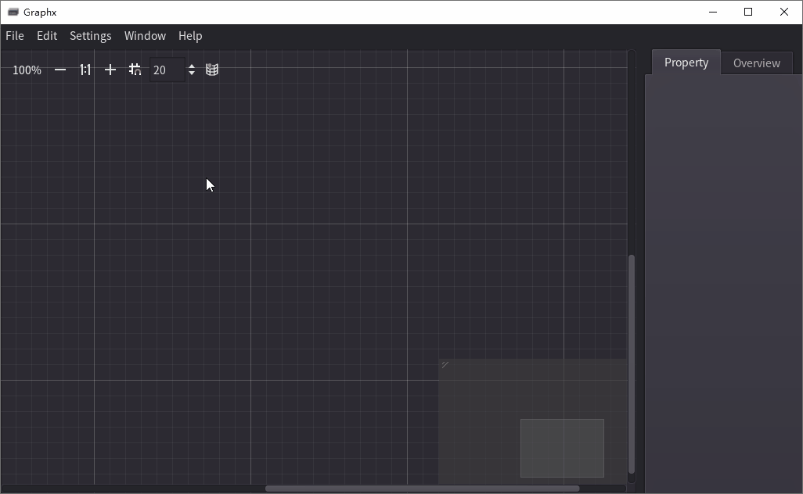
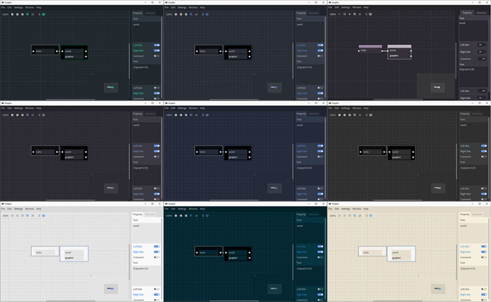

#  Graphx

> [en](README.md) | 中文

- [特点](#特点)
- [安装](#安装)
- [开始使用](#开始使用)
- [从源码构建](#从源码构建)
- [贡献](#贡献)
- [许可证](#许可证)

------

欢迎来到Graphx！

Graphx是一个开源、跨平台的思维导图软件，用可视化图表帮助用户组织信息和想法。它支持Windows、macOS、Linux等操作系统，提供很多特性帮助用户创建高效的思维导图。

你可以尝试[网页版](https://adanelia.github.io/apps/demo/graphx/Graphx.html).

*使用 [Godot](https://godotengine.org/) 3.x 开发*

## 特点

- 高效的编辑
- 通过BBCode实现富文本
- 9个内置主题
- 支持导出图片

## 安装

从 [release](https://github.com/Adanelia/Graphx/releases) 下载二进制文件。

> 字体占了82.9MB，总大小的2/3！:astonished:

> macOS用户可能会被*Gatekeeper*禁止运行。如果是这样，可以直接用Godot Engine运行这个项目或者导出（参见[从源码构建](#从源码构建)）。

> 安卓版还没有很好适配触屏。

## 开始使用

1. 右键或者点击顶部菜单的`Edit`打开`Edit`菜单，以进行节点操作。

2. `Add` 按钮 (ctrl + A) 根据鼠标位置添加一个节点，并自动聚焦到文本编辑器。  
    `Add Left` 按钮 (alt + ←) 在活跃节点左侧添加一个新节点并自动连接起来。  
    `Add Right` 按钮 (alt + →) 在活跃节点右侧添加一个新节点并自动连接起来。  
    `Expand` 按钮 (alt + ↓) 给活跃节点添加一个新行。  
    `Delete` 按钮 (alt + d) 删除活跃节点。

3. 在文本编辑器里输入任何文本。你可以使用[BBCode](https://docs.godotengine.org/en/3.5/tutorials/ui/bbcode_in_richtextlabel.html#reference)使文本更加丰富多彩。

4. 点击拖动来连接节点。

5. `File` - `New/Open/Save/Save as`.

6. `File` - `Export` - `Image` 打开导出窗口。**记得先设置导出路径再点`OK`！**

7. 在 `Settings` 进行设置以及更换主题。

8. ……

> 或许应该重新设计快捷键。

## 从源码构建

### 先决条件

[下载 Godot Engine 3.x](https://godotengine.org/download/3.x/) 如果没有。

### 步骤

1. 克隆或下载zip。
2. 打开Godot Engine，点击导入并选择project.godot文件。

## 贡献

1. Fork the Project
2. Create your Branch (`git checkout -b <branch_name>`)
3. Commit your Changes (`git commit -m '<commit_message>'`)
4. Push to the Branch (`git push origin <project_name>/<location>`)
5. Open a Pull Request

## 许可证

MIT License.

### 第三方

Godot Engine  
MIT License  
Copyright (c) 2014-present Godot Engine contributors.  
Copyright (c) 2007-2014 Juan Linietsky, Ariel Manzur.  
[https://godotengine.org/license](https://godotengine.org/license)

SourceHanMono  
Copyright 2014-2019 Adobe (http://www.adobe.com/), with Reserved Font 
Name 'Source'. Source is a trademark of Adobe in the United States 
and/or other countries.  
This Font Software is licensed under the SIL Open Font License, 
Version 1.1.

SourceHanSansCN  
Copyright 2014-2021 Adobe (http://www.adobe.com/), with Reserved Font 
Name 'Source'. Source is a trademark of Adobe in the United States 
and/or other countries.  
This Font Software is licensed under the SIL Open Font License, 
Version 1.1.
