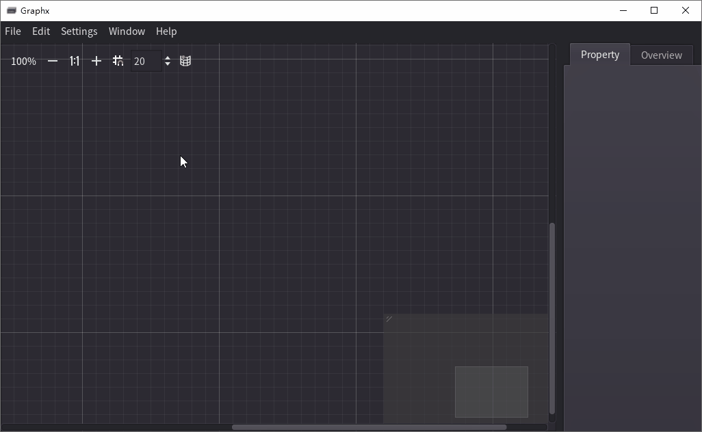
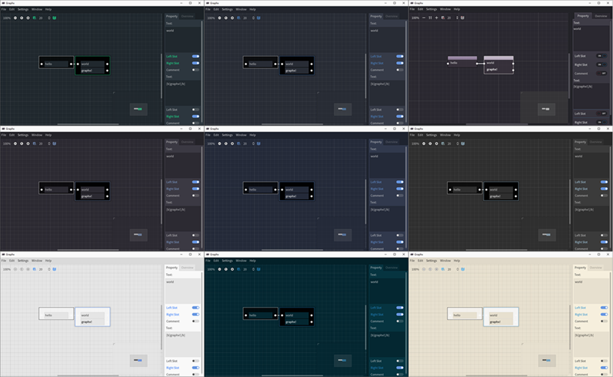

#  Graphx

> en | [中文](README-CN.md)

- [Features](#features)
- [Installation](#installation)
- [Getting Started](#getting-started)
- [From Source](#from-source)
- [Contributing](#contributing)
- [License](#license)

------

Welcome to Graphx!

Graphx is an open-source, cross-platform mind mapping tool that allows users to organize their thoughts, ideas, and information in a visual diagram. It supports Windows, macOS, and Linux operating systems and offers a wide range of features to help users create effective mind maps.

You can try the [web version](https://adanelia.github.io/apps/demo/graphx/Graphx.html).

*Made with [Godot](https://godotengine.org/) 3.x .*

## Features

- Efficient typing
- Rich text by BBCode
- 9 build-in themes
- Image exportation

## Installation

Download the binaries from [release](https://github.com/Adanelia/Graphx/releases).

> Fonts takes 82.9 MB, 2/3 the binary size!:astonished:

> Release for macOS may be blocked by *Gatekeeper*. If so, you can use Godot Engine to run from source or export it yourself (see [From Source](#from-source)).

> Release for Android is not well adapted to touch screens.

## Getting Started

1. Right click or click `Edit` button in top menu to open `Edit` menu, where you manager all nodes.

2. `Add` button (ctrl + A) adds a node relative to your mouse position and automatically focuses on the text editor.  
    `Add Left` button (alt + ←) adds a node to left of the active node and automatically connects them.  
    `Add Right` button (alt + →) adds a node to right of the active node and automatically connects them.  
    `Expand` button (alt + ↓) adds a new line to the active node.  
    `Delete` button (alt + d) deletes the active node.

3. Enter any text in the text editor. You can use [BBCode](https://docs.godotengine.org/en/3.5/tutorials/ui/bbcode_in_richtextlabel.html#reference) to light text up.

4. Connect nodes by dragging.

5. `File` - `New/Open/Save/Save as`.

6. `File` - `Export` - `Image` opens the exporting window. Remembers to set exporting **path** before click `OK`!

7. In `Settings` you can make some configurations and change themes.

8. ...

> Maybe I should redesign the shortcuts.

## From Source

### Prerequisites

[Download Godot Engine 3.x](https://godotengine.org/download/3.x/) if you don't have one.

### Steps

1. Clone or download zip.
2. Open Godot Engine, click import and select project.godot file.

## Contributing

1. Fork the Project
2. Create your Branch (`git checkout -b <branch_name>`)
3. Commit your Changes (`git commit -m '<commit_message>'`)
4. Push to the Branch (`git push origin <project_name>/<location>`)
5. Open a Pull Request

## License

MIT License.

### Third party

Godot Engine  
MIT License  
Copyright (c) 2014-present Godot Engine contributors.  
Copyright (c) 2007-2014 Juan Linietsky, Ariel Manzur.  
[https://godotengine.org/license](https://godotengine.org/license)

SourceHanMono  
Copyright 2014-2019 Adobe (http://www.adobe.com/), with Reserved Font 
Name 'Source'. Source is a trademark of Adobe in the United States 
and/or other countries.  
This Font Software is licensed under the SIL Open Font License, 
Version 1.1.

SourceHanSansCN  
Copyright 2014-2021 Adobe (http://www.adobe.com/), with Reserved Font 
Name 'Source'. Source is a trademark of Adobe in the United States 
and/or other countries.  
This Font Software is licensed under the SIL Open Font License, 
Version 1.1.
